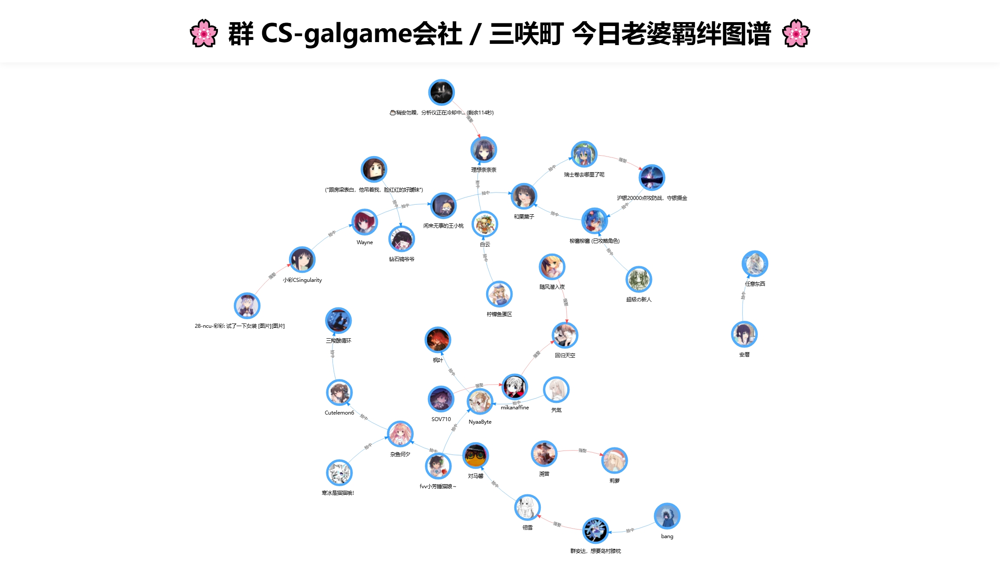

# 🌸 AstrBot 活跃成员抽老婆插件

基于 [AstrBot](https://github.com/Soulter/AstrBot) 的群聊互动插件。通过记录群内活跃成员（30天内发言的用户），实现随机抽取“今日老婆”的功能，并生成群内成员间的羁绊关系图谱。

## ✨ 功能亮点

* **活跃筛选**：仅从 30 天内有发言记录的“活人”中抽取，自动过滤机器人与 ID 为 0 的异常账号。
* **头像展示**：抽取结果附带 640px 高清 QQ 头像，视觉体验更佳。
* **可视化关系**：基于 `Vis.js` 渲染生成高清关系网络图，直观展示群内“错综复杂”的老婆关系。
* **智能名称识别**：图谱自动关联用户昵称，优先显示老婆名而非数字 ID。
* **灵活管控**：支持 **群聊白名单** 和 **黑名单**，以及每人每日抽取次数限制。

## 🎮 使用指令

| 指令 | 别称 | 权限 | 说明 |
| --- | --- | --- | --- |
| `/今日老婆` | `抽老婆` | 用户 | 随机抽取一名今日老婆 |
| `/强娶 @用户` | `强娶` | 用户 | 消耗次数强制与指定用户建立羁绊 |
| `/关系图` | `羁绊图谱` | 用户 | 生成并发送本群今日的老婆关系网络图 |
| `/我的老婆` | `抽取历史` | 用户 | 查看今天抽到的记录及次数 |
| `/重置记录` | - | 管理员 | 清空所有今日抽取记录 |
| `/抽老婆帮助` | - | 用户 | 查看详细指令说明 |

## 功能演示

## 🛠️ 安装环境要求

本插件的关系图功能依赖于 AstrBot 的浏览器渲染引擎：（一般自带，不用另外装）

1. 请确保你的 AstrBot 环境已正确安装 `Playwright` 浏览器驱动。
2. 插件目录下需包含 `graph_template.html` 模板文件。
3. 渲染过程需要联网加载 `Vis.js` 库（已优化使用国内高速 CDN）。

## ⚙️ 配置项说明

在 AstrBot 管理面板或 `_conf_schema.json` 中可配置以下内容：

| 配置键 | 类型 | 默认值 | 说明 |
| --- | --- | --- | --- |
| `daily_limit` | int | 3 | 每人每天可抽取的次数上限 |
| `max_records` | int | 500 | 全局 JSON 存储的最大记录条数 |
| `excluded_users` | list | [] | 永远不会被抽中的 QQ 号列表 |
| `whitelist_groups` | list | [] | 白名单模式：仅在此列表中的群生效 |
| `blacklist_groups` | list | [] | 黑名单模式：列表中的群将禁用插件 |
